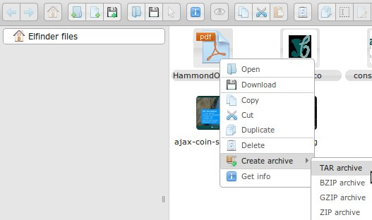

.. yawd-elfinder documentation master file, created by
   sphinx-quickstart on Sat Aug 25 14:35:03 2012.
   You can adapt this file completely to your liking, but it should at least
   contain the root `toctree` directive.

yawd-elfinder django application documentation
==============================================

`elFinder`_ is a jQuery web file manager providing standard features -such as 
uploading, moving, renaming files etc-, as well as a set of advanced features
such as image resizing/cropping/rotation and archive file creation.

**yawd-elfinder** provides a fully-featured python/django implementation 
for the elfinder connector v.2. A custom Model Field (tied to a nice 
form widget) is also provided. Therefore, you can easily manage your local
and remote files through the Django admin interface, assign them to model 
fields and access the file URLs in your Django templates.

.. _elfinder: http://elfinder.org

.. _django-versions:

Django version compatibility
++++++++++++++++++++++++++++

The following yawd-elfinder versions might also work with other Django 
releases (older or newer), however such combinations are NOT tested.

| **yawd-elfinder v0.80.16:** `Django v.1.4.1 <https://www.djangoproject.com/m/releases/1.4/Django-1.4.1.tar.gz>`_
| **yawd-elfinder v0.90.00:** `Django v 1.4.2 <https://www.djangoproject.com/m/releases/1.4/Django-1.4.2.tar.gz>`_
| **yawd-elfinder v0.90.01:** `Django v.1.4.2 <https://www.djangoproject.com/m/releases/1.4/Django-1.4.2.tar.gz>`_
| **yawd-elfinder v0.90.03:** `Django v.1.4.5 <https://www.djangoproject.com/m/releases/1.4/Django-1.4.5.tar.gz>`_

Contents:

.. toctree::
   :maxdepth: 2

   requirements
   installation
   usage
   connectivity
   localization
   ref/index

Indices and tables
==================

* :ref:`genindex`
* :ref:`modindex`
* :ref:`search`